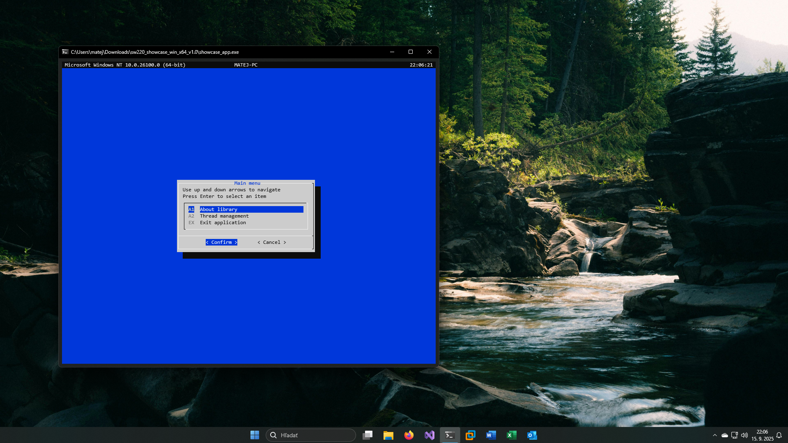

# 🖥️ SW220 LIB
**SW220 LIB** is a lightweight, cross-platform console UI framework built on top of [Spectre.Console](https://spectreconsole.net/). Inspired by classic Linux `dialog` utilities, it brings intuitive menu navigation, input handling, and thread-safe execution to modern .NET applications.

Whether you're running on Windows or Linux, SW220 LIB delivers a consistent and styled terminal experience—perfect for system tools, admin interfaces, or interactive scripts.

## ✨ Features

- **Menu Navigation** — Keyboard-driven selection with clean layout
- **Input Prompts** — Text, confirmation, and selection dialogs
- **Thread-Safe Execution** — Background task handling without UI glitches
- **Spectre.Console Styling** — Rich formatting, panels, and markup
- **Cross-Platform** — Works seamlessly on Windows and Linux terminals

## 📸 Screenshots 



## 🚀 Getting Started
Clone the repo and run the showcase app:
```bash
git clone https://github.com/Mateej220/SW220.git
cd SW220
dotnet run
```

Alternatively, download a precompiled binary for your platform from the [Releases](https://github.com/Mateej220/SW220/releases) and run it directly — no build required.
